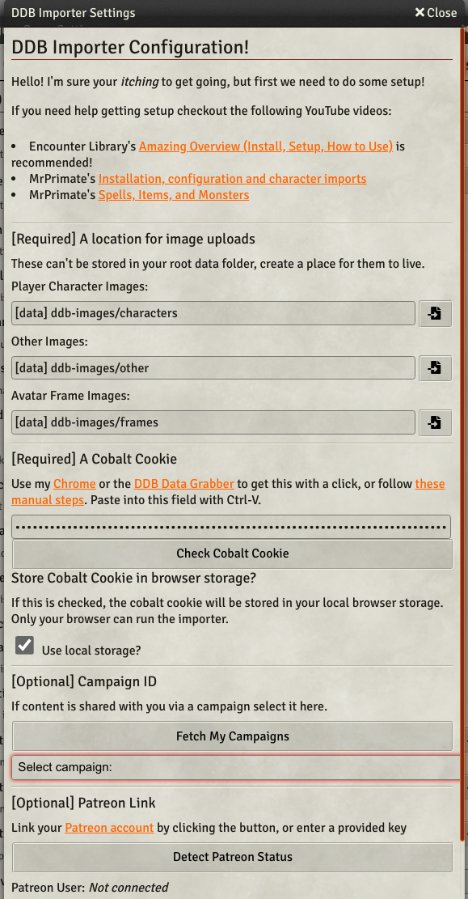
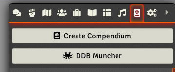
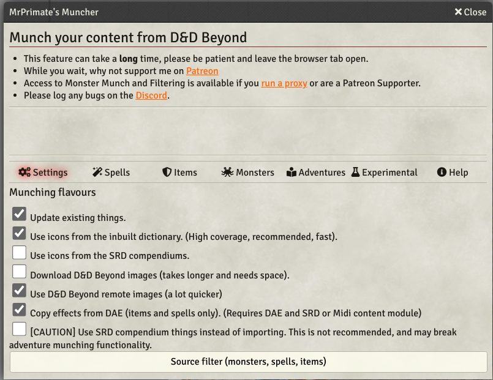
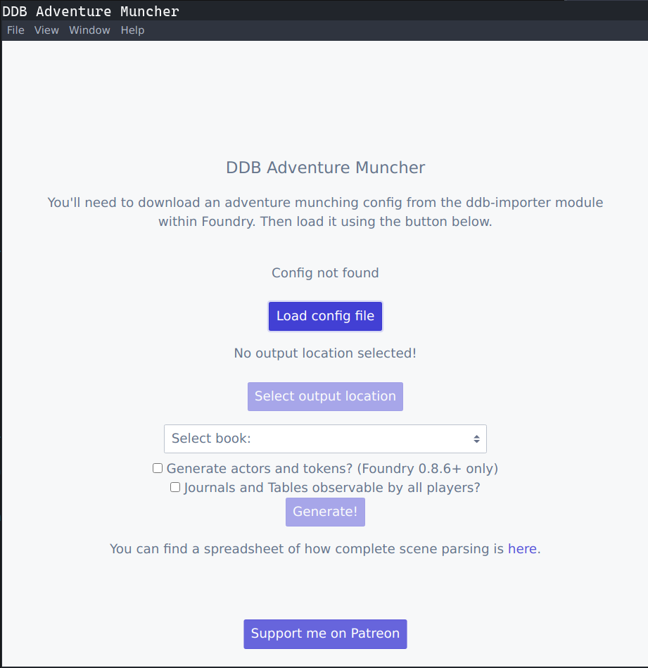

# DDB Adventure Muncher Guide


## What is it?

The Adventure Muncher can integrate the adventures/books you own on D&D Beyond into Foundry Virtual Table Top.

## Install

There are two parts to install to get munching. This guide assumes you're using Adventure Muncher 0.4.0+ and DDB Importer 2.4.0+.

* Install the [DDB Importer](https://foundryvtt.com/packages/ddb-importer/) module into Foundry.
* [Adventure Muncher](https://github.com/MrPrimate/ddb-adventure-muncher/releases/latest) to generate an adventure to import into Foundry using DDB Importer.
This is a stand-alone application like Foundry.

### Foundry Module

This module acts as the bridge to allow your DDB content to get into Foundry.
We need to install this and get our spells, items, and monsters into Foundry before importing an adventure.

1. Install the module in Foundry Setup.
2. Enable the module in Foundry.
3. Navigate to the module setting (Game setting > Configure setting > Module settings > D&D Beyond Importer > Core setup).
You should see a scene that looks like this:

4. Most of the settings should be good with the defaults.
However, we do need to get a "Cobalt Cookie" value.
This is a password that allows the importer to access D&DBeyond as you.
You can either grab the cookie value manually or use one of the two tools to get it.
Click on the links in the setting description to find out more.
Once you have the cookie, paste it into the field and click "Check Cobalt Cookie" to ensure it is correct.
5. Scroll down.
To import monsters, you will either need to be a [Patreon](https://www.patreon.com/MrPrimate) supporter or run your own [proxy](https://github.com/MrPrimate/ddb-proxy).
If using Patreon, click the button to detect your user.
6. Click the Save button at the bottom!
It's real easy to forget.
7. In the menu, open the Compendiums tab and click the DDB Muncher button.

8. If you've not used the Muncher before, the default settings will be fine.

9. Click the Adventures tab, and click Generate Adventure Muncher Config File.
This will download a config file that can be used by the Adventure Muncher.
We will return to this screen to use the Import Generated Adventure button when the Muncher has done its work!


### Adventure Muncher

1. Download the [Adventure Muncher](https://github.com/MrPrimate/ddb-adventure-muncher/releases/latest) from this link.
If you're using Windows, you want the file ending `.exe`, if you're using a Mac `.dmg`, and if you're using Linux, you have a choice between a deb, rpm or AppImage (stand-alone).
2. Install the software as is appropriate for your OS.
3. Run the software.
You should get a screen as follows:

4. Click the "Load config file" button and browse to the config file you downloaded from within Foundry.
Once loaded into Adventure Muncher, you can remove the download. Adventure Muncher stores the config in its own settings folder.
5. You should now select a folder to output the generated adventures and set it with the "Select output location button".
6. You should now be able to select an adventure to generate.
You need to have access to this content on D&D Beyond.
7. If you want to generate tokens on scenes (Foundry v8+ only), then tick "Generate actors and tokens?".
Please note that not all scenes have actors placed on them at the moment.
This is a community effort, and you can see the current progress at the [spreadsheet](https://docs.google.com/spreadsheets/d/17b4jG2W521N_nFkE1jr2UGEjixHGjHGnEO9eSKhFmwo/edit?usp=sharing).
8. If you wish all the Journal and Table entries to be viewable by players (useful in books such as The Players Handbook), tick this option.
9. Click Generate.
It may take a few minutes to generate an adventure, depending on the speed of your computer and internet.
If you have problems, see the [Troubleshooting](#troubleshooting) section.


## Troubleshooting and FAQs

### My adventure never seems to generate!

1. If using Windows, try right-clicking and Run As Administrator. On some setups, this appears to be needed.
2. Try clearing the downloaded files `File -> Remove downloaded files`, a download may have become corrupted.
3. Get the log file! It is cleared everytime the app is opened, and can be found by going to Help -> Log file location.
4. If you can't identify the problem, please reach out on Discord in the [#adventure-muncher](https://discord.gg/ZZjxEBkqSH) channel.

#### Old method:

Try running from the command line:

* Windows users: right-click on the application icon on the desktop
* There should be a field called "Target" copy all of the text in there. in mine it's `C:\Users\jack\AppData\Local\Programs\ddb-adventure-muncher\ddb-adventure-muncher.exe`
* If you're using a Mac or Linux, you can figure the above out yourself
* In the start menu, type "command prompt" and open the command prompt
* Enter the above command that was copied
* When you click on buttons, it should output information to the terminal window.
Look for the error.

### Arch (and Arch-based OS) or Linux with

You may get an [error](https://github.com/MrPrimate/ddb-adventure-muncher/issues/8):

```
[2021-10-17 18:58:08.766] [error] Error: SQLITE_NOTADB: file is not a database
--> in Database#each('\n' +
  'SELECT ID as id, CobaltID as cobaltId, ParentID as parentId, Slug as slug, Title as title, RenderedHTML as html\n' +
  'FROM Content\n', [Function: rowGenerate], [AsyncFunction: collectionFinished])
    at Database.<anonymous> (/tmp/.mount_ddb-aduIneDx/resources/app.asar/munch/book.js:1506:8)
    at Object.getData (/tmp/.mount_ddb-aduIneDx/resources/app.asar/munch/book.js:1497:6)
    at /tmp/.mount_ddb-aduIneDx/resources/app.asar/main.js:232:14
    at runMicrotasks (<anonymous>)
    at processTicksAndRejections (internal/process/task_queues.js:93:5)
```

This is due to newer versions of GTK3 shipping sqllite as a core library. A workaround for now:

Ensure that libsqlcipher is installed:

```
sudo pacman -Sy sqlcipher
```

Then run the adventure muncher by first setting the environment variable `LD_PRELOAD=/usr/lib/libsqlcipher.so`

`LD_PRELOAD=/usr/lib/libsqlcipher.so ./ddb-adventure-muncher.appImage`

or if running from source:

`LD_PRELOAD=/usr/lib/libsqlcipher.so npm start`

### How do I reset the Muncher?

If you wish to reset your configuration use the `File -> Reset config` menu item.

The Adventure Module also generates a database of "lookup ids" for you. This is so that when you reimport an adventure, it will overwrite the existing Scenes/Journal entries. You may need to remove this, use the `File -> Reset generated ids` menu item.

### Delete downloads

If you wish to download the content again, rather than using existing downloaded content, use the `File -> Remove downloaded files`.

### Handouts are not named

Most of the Handouts are un-named because it's hard to parse names - I'll be collecting naming suggestions at some point.

### Where is the config and downloaded adventure data stored?

You can use `Help -> Config location` menu item to find your config folder.

Likely paths:

* Linux: `~/.config/ddb-adventure-muncher`
* Mac OS: `~/Library/Application Support/ddb-adventure-muncher`
* Windows: `C:\Users\<user>\AppData\Roaming\ddb-adventure-muncher`


### How do I update an existing adventure?

You need to delete (make a backup first) any material you wish to update.
Adventure muncher will offer to replace scenes that have been updated but does not update/replace any existing Journals, tables or actors in your world.

### How do I contribute to the scenes?

See [the contribution page](./scenes.md).

### Getting More Help

Join us on Discord in the [#adventure-muncher](https://discord.gg/ZZjxEBkqSH) channel.
